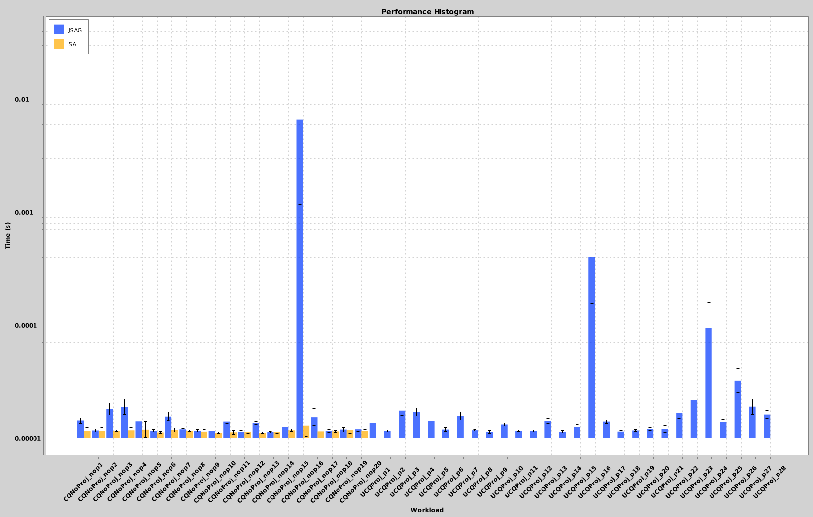

# Sparql Query Containment Benchmark

# Overview

This repository contains a SPARQL query containment benchmark runner, together with the benchmarkseveral implementations of SPARQL query containment checkers.
Besides our own approaches (JSAG), we included all implementations from the download bundle of
http://sparql-qc-bench.inrialpes.fr/ version 1.4, namely *SparqlAlgebra* aka *SA*, *TreeSolver* aka *LMU*, and *AFMU*.

Thereby, our own benchmark runner is a *significantly* improved version of that included in the download bundle:

* We bundled all query containment checkers as OSGI plugins which allows the benchmark runner to evaluate implementations even with conflicting dependencies (LMU and AFMU) in the same java process. The advantages are, that this saves time and it also makes it easy to add future implementations without having to worry about possible conflicts with prior implementations.
* We fixed the AFMU ContainmentWrapper to properly reset its state after each containment test (using hacks based on reflection). In its original implementation, the java process needed to be restarted after every single containment check. ***Hence, the original benchmark does not perform warm-up runs***.
* We took great care to only measure the time needed to perform SPARQL query containment checks- i.e. we do not measure thread creation, just-in-time compilation, or SPARQL query parsing. Note, that any time needed to further process parsed SPARQL query objects (e.g. mu-algebra) is counted.

***For above reasons we consider our results more accurate. Especially, we show that containment checking is significantly faster than being suggested in the orginal evaluation***

Before running the main class, you need to build all OSGI plugin JARs (so that they can be loaded for benchmarking) using `mvn clean install`.
The main class is [this one](develop/benchmarking/sparqlqc-jena3/sparqlqc-core/src/main/java/fr/inrialpes/tyrexmo/testqc/MainTestContain.java)

## Results

The benchmark runner generates RDF datasets with the result statistics. It is not yet a perfect datacube, but we are
working on the [beast tool](https://github.com/SmartDataAnalytics/Beast) to do the heavy lifting of creating nice RDF datasets.
Most prominently, our datasets contain - besides observation data - RDF resources that map these data to charts using our [Chart Vocabulary](https://github.com/SmartDataAnalytics/Beast/tree/develop#charts-in-rdf---the-chart-vocabulary).
If you install the beast debian package, you can recreate the charts using `ldcharts dataset.ttl`.

### JSAG vs SA
A comparision of our sparql query containment system vs SA

* [Result dataset for JSAG vs SA](sparqlqc-results/sparqlqc-results_jsag_sa.ttl)

### Overall statistics
* [Result dataset for JSAG, SA, AFMU, and TS](sparqlqc-results/sparqlqc-results_jsag_sa_afmu_ts.ttl)

